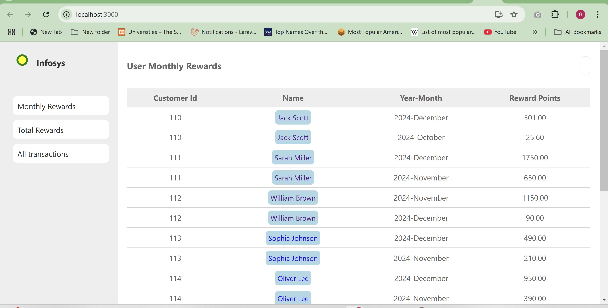
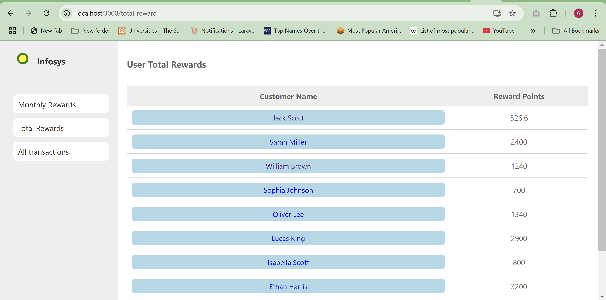
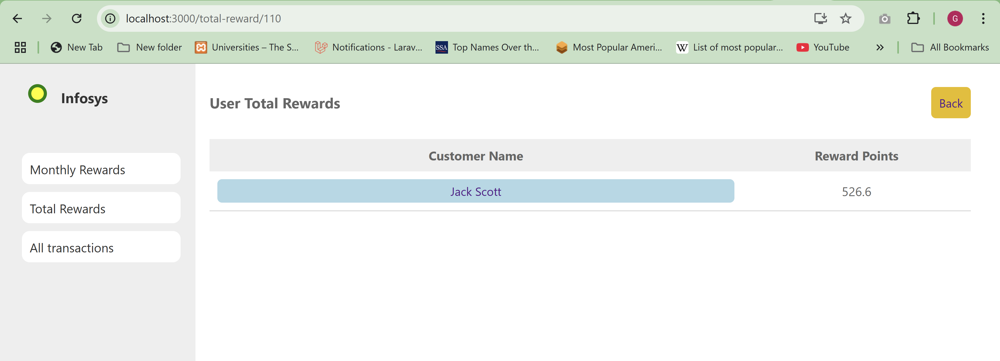
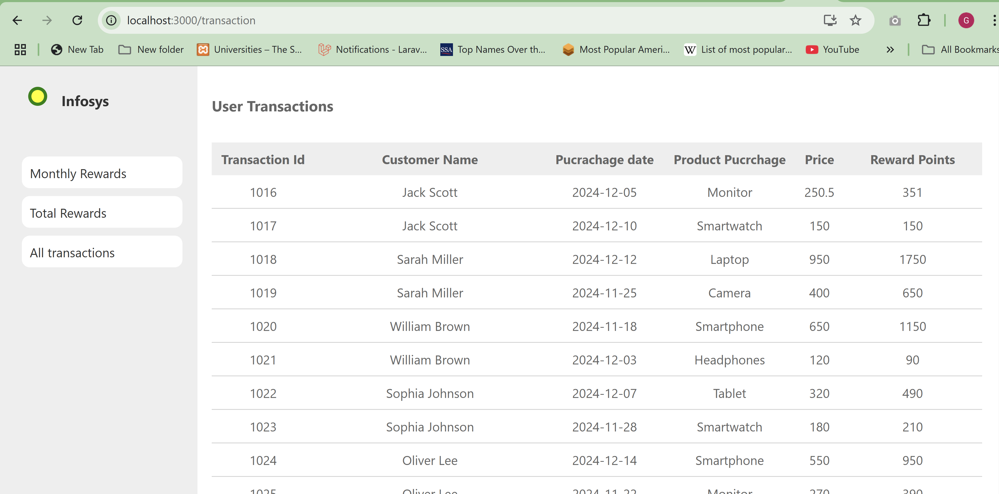
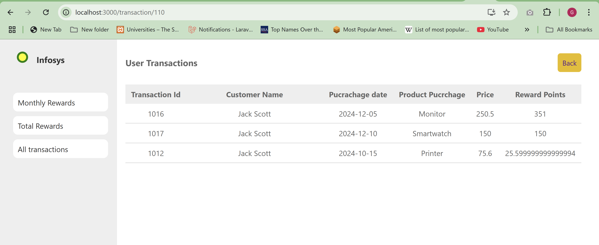

# My Project

## Project Setup

# Clone the repository: 
   ```bash
   git clone https://github.com/ganeshku73/retailer_int.git
   ```

# Install dependencies:
   ```bash
   npm install

## Available Scripts

In the project directory, you can run:

### `npm start`

Runs the app in the development mode.\

### `npm test`

Launches the test runner in for reward point calculation.

## `Screenshots`

Here is a screenshot of my app:

## Screenshots

Here is a screenshot of my app:









